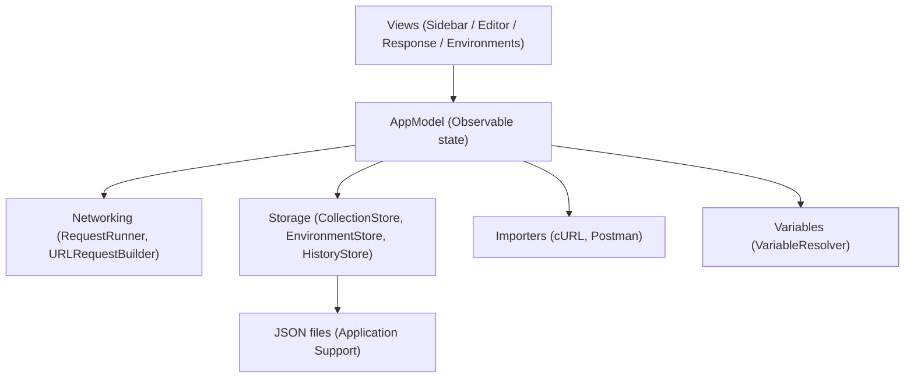

<h1 align="center">APIForge</h1>

<p align="center">
  <strong>Native multiplatform API client for macOS, iPadOS, and iOS</strong><br/>
  <sub>Like Postman, but built entirely in SwiftUI, running fully offline, with no account required.</sub>
</p>

<p align="center">
  
  
  
  
</p>

---

## Table of Contents

- [Screenshots](#screenshots)
- [Features](#features)
- [Tech Stack](#tech-stack)
- [Architecture](#architecture)
- [Folder Structure](#folder-structure)
- [Storage](#storage)
- [Getting Started](#getting-started)
- [Testing](#testing)
- [CI/CD](#cicd)
- [Privacy & Permissions](#privacy--permissions)
- [Accessibility](#accessibility)
- [Project Status](#project-status)
- [Roadmap](#roadmap)
- [Contributing](#contributing)
- [License](#license)
- [Author](#author)

---

## Screenshots

<p align="center">
  
</p>
<p align="center">
  
  
</p>

> _Add screenshots to `projects/assets/apiforge/` and update the filenames above (Mac/iPad/iPhone views show off the multiplatform layout)._

---

## Features

### Requests
- HTTP methods: GET, POST, PUT, PATCH, DELETE, HEAD, OPTIONS
- Query params, headers, and body editors (raw, JSON, form-urlencoded, multipart with file parts)
- Auth tab (basic / bearer)
- Inline editable request name and resolved-URL preview with unresolved-variable hints
- Keyboard shortcuts: `⌘⏎` to send, `⌘N` for a new request

### Collections & History
- Collections and folders saved as JSON files (git-friendly)
- Sidebar with collapsible collections, request count badges, rename / duplicate / delete
- Request history (last 200) with tap-to-load, swipe-to-delete, clear-all, and "Add to Collection"

### Environments & Variables
- Multiple environments with editable key/value rows
- `{{variable}}` substitution across URL, headers, params, and body
- Environment picker in the main toolbar

### Import / Export
- Paste-cURL detection with import banner
- Postman v2.1 collection import and export
- Copy any request as cURL

### Polish
- Toasts for send / import / export success and errors
- Empty states and keyboard shortcuts throughout

---

## Tech Stack

| Area | Technology |
|------|-----------|
| UI | SwiftUI |
| Concurrency | Swift Concurrency (async/await) |
| Networking | URLSession |
| Persistence | JSON files (Application Support directory) |
| Testing | Swift Testing |
| Platforms | macOS 14+, iPadOS 17+, iOS 17+ |

---

## Architecture

The app is organized around observable state (`AppModel`) driving SwiftUI views, with networking and storage kept as separate, independently testable layers.



**Key decisions**
- Single SwiftUI codebase adapts its layout for each platform (Mac sidebar, iPad split view, iPhone stack) rather than maintaining separate UIs.
- Networking, storage, and import/export are independent layers behind `AppModel` — no view talks to disk or the network directly.
- No cloud sync, no account system — all state is local, human-readable JSON.

---

## Folder Structure

```
APIForge/
  APIForge/
    APIForgeApp.swift         # App entry
    AppModel.swift            # Observable app state
    AppNotifications.swift
    ContentView.swift
    Models/                   # APIRequest, Collection, Environment, RequestBody…
    Networking/               # RequestRunner, URLRequestBuilder, RequestError
    Storage/                  # CollectionStore, EnvironmentStore, HistoryStore, JSONFileStore
    Importers/                # CurlParser, CurlExporter, PostmanImporter, PostmanExporter
    Variables/                # VariableResolver
    Views/
      Sidebar/                # Collections + history list
      Editor/                 # Request editor (params/headers/body/auth)
      Response/                # Response viewer (status, body, headers)
      Environments/            # Picker + editor
  APIForgeTests/               # Swift Testing unit tests
  APIForgeUITests/
docs/                          # Specs and implementation plans
```

---

## Storage

All data is persisted as JSON under the app's Application Support directory:

- `collections/*.json` — one file per collection
- `environments.json` — environments and active selection
- `history.json` — capped at 200 entries

Files are human-readable and safe to check into version control.

---

## Getting Started

### Requirements
- macOS 14+, Xcode 15+
- Target: macOS 14+, iPadOS 17+, iOS 17+
- No accounts/keys needed

### Clone
```bash
git clone https://github.com/sokpichdev/APIForge.git
cd APIForge
```

### Configuration
No configuration needed.

### Install dependencies / Run
Open `APIForge/APIForge.xcodeproj` in Xcode 15+ (Swift Package Manager dependencies resolve automatically) and run the **APIForge** scheme on macOS, iPadOS, or iOS.

---

## Testing

```bash
xcodebuild test -project APIForge/APIForge.xcodeproj -scheme APIForge -destination 'platform=macOS'
```

- Uses **Swift Testing** — run with `⌘U` in Xcode or the command above
- **Coverage target:** none set yet — TODO
- **Test doubles:** ad hoc per test — TODO

---

## CI/CD

No CI/CD is configured yet — there's no `.github/workflows/` and no Fastlane setup. Tests currently run locally via Xcode/`xcodebuild` only. — **TODO**

---

## Privacy & Permissions

- No OS-level permissions are requested — the app has no camera, location, or notification usage.
- **Data collected:** none. The app is fully offline, requires no account, and has no analytics or telemetry.
- **Third parties:** none — requests only go to whatever endpoints the user configures themselves.

---

## Accessibility

Accessibility has not been formally audited yet — VoiceOver labeling, Dynamic Type scaling, and contrast ratios are best-effort, not verified. — **TODO**

---

## Project Status

🚧 In active development — core request/response flow, collections, environments, and Postman/cURL import-export are working; polish and additional auth types are ongoing.

---

## Roadmap

- [ ] Additional auth types (e.g. OAuth2)
- [ ] GraphQL support
- [ ] Response diffing between requests

---

## Contributing

No `CONTRIBUTING.md` exists yet — **TODO**. In the meantime:
1. Fork and create a feature branch (`git checkout -b feat/thing`)
2. Commit using [Conventional Commits](https://www.conventionalcommits.org/)
3. Open a PR against `main`

---

## License

No `LICENSE` file exists yet — **TODO**. Do not treat this project as licensed for reuse until one is added.

---

## Author

**Sok Pich** — [@sokpichdev](https://github.com/sokpichdev)
