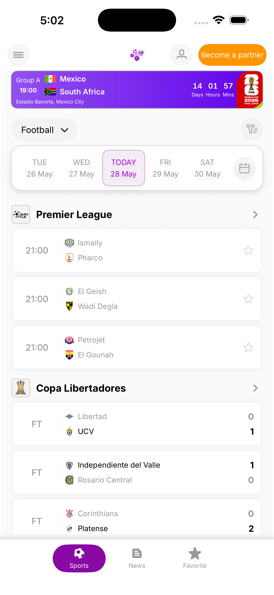
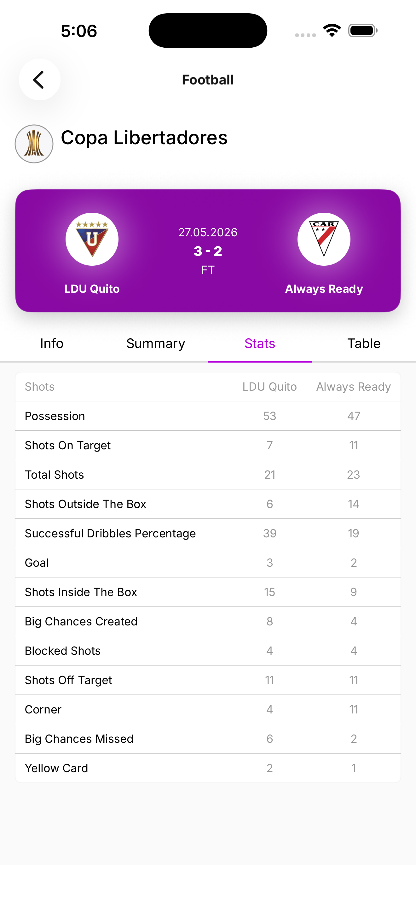
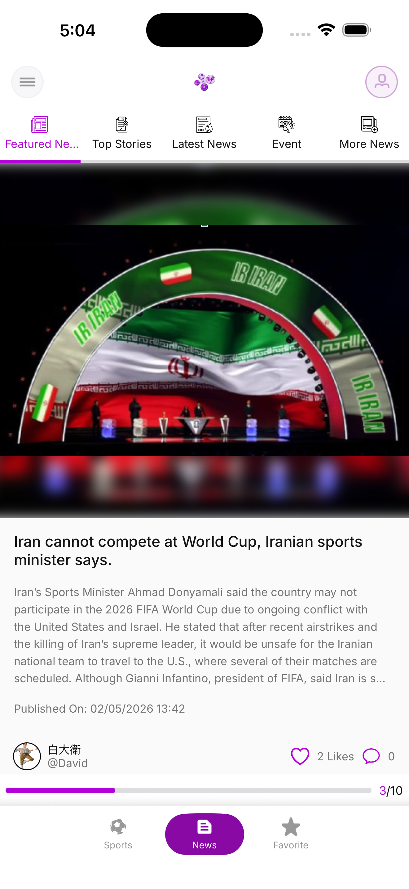
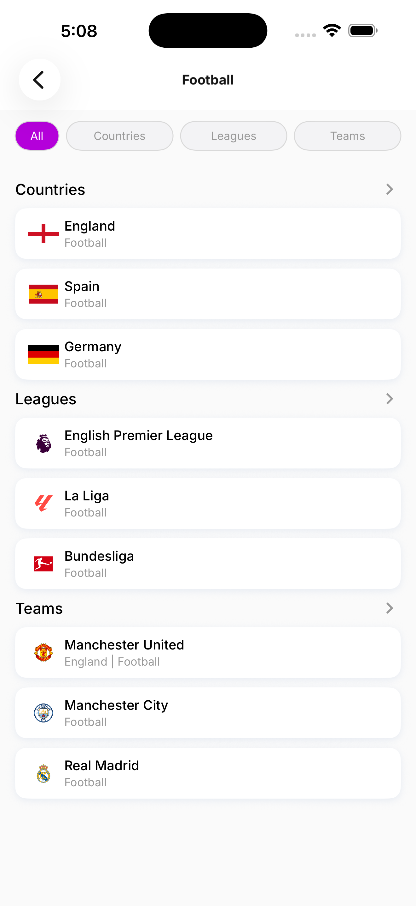
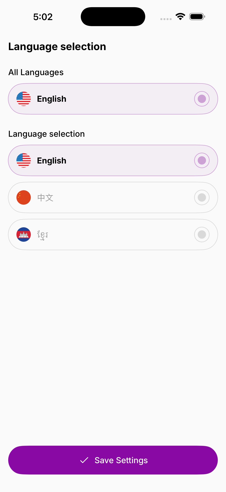
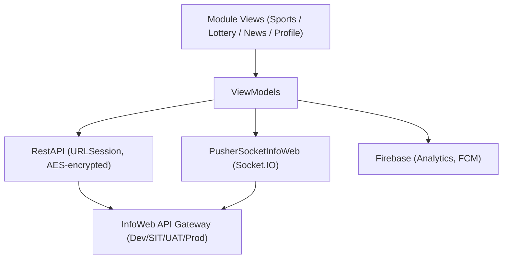

<h1 align="center">LuckyInfos</h1>

<p align="center">
  <strong>Sports & Lottery information platform — real-time live scores and results across multiple countries</strong><br/>
  <sub>Shipped to the App Store, with Socket.IO live match streaming and AES-encrypted API traffic.</sub>
</p>

<p align="center">
  
  
  
  
  
</p>

<p align="center">
  <a href="https://apps.apple.com/kh/app/luckyinfos/id6477772364">📱 App Store</a>
</p>

---

## Table of Contents

- [Screenshots](#screenshots)
- [Features](#features)
- [Tech Stack](#tech-stack)
- [Architecture](#architecture)
- [Folder Structure](#folder-structure)
- [Try It](#try-it)
- [Testing](#testing)
- [CI/CD](#cicd)
- [Privacy & Permissions](#privacy--permissions)
- [Accessibility](#accessibility)
- [Project Status](#project-status)
- [Author](#author)

---

## Screenshots

<p align="center">
  
  
  
  
  
</p>

---

## Features

### Sports
- Live match scores with real-time Socket.IO updates
- Leagues, teams, and standings browsers
- Fixtures and historical results
- Bookmark favorite matches for quick access

### Lottery
- Lottery games browsed by country
- Past result history and number lookups
- Random number generation
- Community player predictions

### News Feed
- Integrated news feed via a custom internal library (NewsFeedKit)

### Search & Discovery
- Global search across sports and lottery data
- Advanced lottery filtering by country with drag-and-drop ordering and persistent preferences

### Account & Profile
- Email and phone authentication with OTP and password options
- User profile management and password change
- Account deletion flow
- Forgot-password recovery

### App Experience
- Push notifications via Firebase Cloud Messaging
- Multi-language support with API-driven translations and in-app language switcher
- Dark mode toggle
- Offline detection with a no-connection overlay and request retry on reconnect
- Footer advertisements on the main tab bar

---

## Tech Stack

| Layer | Choice |
|---|---|
| **Language** | Swift 5 |
| **UI** | SwiftUI (primary) with UIKit interop |
| **Architecture** | MVVM (Model / View / ViewModel) |
| **Networking** | URLSession-based `RestAPI` singleton, AES-encrypted request payloads |
| **Realtime** | Socket.IO (`PusherSocketInfoWeb`) for live match scores |
| **Backend / BaaS** | Firebase (Analytics, Cloud Messaging) |
| **Images** | SDWebImageSwiftUI (50 MB memory + 200 MB disk cache) |
| **Keyboard** | IQKeyboardManager |
| **Internal library** | NewsFeedKit-iOS (proprietary Loma Technology package) |
| **Connectivity** | Custom NetworkMonitor / Reachability |
| **Linting** | SwiftLint |
| **Dependencies** | Swift Package Manager |
| **Environments** | Dev, SIT, UAT, Production (distinct API gateways + compile flags) |

---

## Architecture

The app is SwiftUI-first and follows MVVM throughout, with a central `RestAPI` singleton handling all HTTP requests and a generic `BaseModel<T>` wrapping every API response with status, message, and pagination metadata. The app launches directly into the main tab bar — no login wall — with login prompted only when a gated action is triggered:

```
lang not set → Language selection (first launch)
otherwise    → Main tab bar (Sports · Lottery · News · Favourites · Profile)
```

**Guest vs. authenticated access:**

| Area | Guest | Requires Login |
|------|-------|---------------|
| Sports — browse matches, leagues, standings | ✅ | |
| Sports — bookmark a match as favourite | | ✅ |
| Lottery — browse results by country | ✅ | |
| Lottery — apply saved filters | | ✅ |
| News Feed — read articles | ✅ | |
| News Feed — interact (comments, reactions) | | ✅ |
| Favourites tab | | ✅ |
| Profile & account settings | | ✅ |



**Key decisions**
- Global singletons (`NavManager`, `NavigationState`, `UserPreference`) coordinate navigation and persistent preferences across modules.
- A pending-request queue retries calls automatically when connectivity is restored, so a dropped connection doesn't lose in-flight actions.
- Sensitive registration data is AES-encrypted client-side before it goes over the wire, on top of TLS.

---

## Folder Structure

```
InfoWebiOS/
├── App/               # Entry point, AppDelegate, environment setup
├── Modules/
│   ├── Main/          # Tab bar, footer ads, dark mode toggle
│   ├── Login/         # Email / phone auth, OTP, remember-me
│   ├── Register/      # New user registration
│   ├── ForgetPassword/
│   ├── Profile/       # Profile view, password change, account deletion
│   ├── SportTab/      # Matches, leagues, standings, fixtures, results
│   ├── Lottery/       # Countries, games, results, predictions
│   ├── FavouriteTab/  # Bookmarked sports & lotteries
│   ├── Search/        # Global search
│   ├── FilterLotteries/ # Country filter with drag-and-drop ordering
│   ├── Language/      # Language selection & API-driven translations
│   ├── SideMenu/
│   └── Contact/       # Support contact form
├── Common/
│   ├── APIManager/    # RestAPI, APIEndPoint, BaseModel, AES encryption
│   ├── CustomView/    # Shared UI: Toast, LoadingView, NoConnectionView,
│   │                  # MaterialTextField, RadioButton, SegmentedControl…
│   ├── Extension/     # String, Date, Int, UIFont, Color helpers
│   ├── NetworkMonitor/
│   ├── Socket/        # PusherSocketInfoWeb (Socket.IO wrapper)
│   └── Utilities/     # Singleton managers, UserPreference, NavManager
└── Resources/         # Assets, Fonts, Firebase config, bridging header
```

---

## Try It

LuckyInfos is shipped and live on the App Store — the fastest way to see it is to install it, not build it locally (it's proprietary, closed-source software built at Loma Technology, so the source isn't public anyway).

<p align="center">
  <a href="https://apps.apple.com/kh/app/luckyinfos/id6477772364">📱 Get it on the App Store</a>
</p>

---

## Testing

No test coverage information was available to verify — **TODO**.

---

## CI/CD

No CI/CD configuration was found in the archive available for review — **TODO**.

---

## Privacy & Permissions

- **Data collected:** account/registration data is AES-encrypted client-side before transmission; specifics of server-side retention are not published — **TODO**.
- **Third parties:** Firebase (Analytics, Cloud Messaging).
- **Full policy:** not published — **TODO**.

---

## Accessibility

Not formally audited — **TODO**.

---

## Project Status

✅ Shipped to the App Store and used by real sports fans and lottery followers across multiple countries — a production codebase developed and maintained by a multi-engineer team at Loma Technology Cambodia (13 feature modules, 15+ ViewModels, 200+ Swift files).

---

## Author

**Sok Pich** — [@sokpichdev](https://github.com/sokpichdev)
<sub>Contributed as part of a multi-engineer team at Loma Technology (Cambodia); not the sole author of this codebase.</sub>
